#  Trabean

##  프로젝트 소개

함께하는 여행을 위한 공금 관리 및 결제 솔루션

### 1. 프로젝트 목표

- 사용자가 공금 관리의 어려움을 해소하고 온전히 여행의 즐거움을 즐길 수 있도록 함

<br>

### 2. 프로젝트를 하게 된 배경 또는 근거

- 최근 해외 여행 수요 급증
- 여행 중 공금 관리의 어려움
  - 모든 인원이 잔액을 알기 어려움
  - 결제를 하려면 총무를 통해 결제할 수 밖에 없음
  - 내역을 투명하게 관리하지 못 하는 경우가 있음
- 여행시 공금 관리의 어려움을 해결하고자 기획

<br>

### 3. 주요 기능

- **공금 모으기:** 여행을 함께하는 친구들을 초대해 여행 비용을 모을 수 있는 기능
- **투명한 자금 관리:** 공금의 입출금 내역을 모든 참여자가 실시간으로 확인 가능
- **가계부:** 일 별 사용 금액 조회, 카테고리 별 사용 금액 조회
- **공금 결제 및 이체:** 여행 중 발생하는 비용을 공금에서 바로 결제
- **환전 기능:** 공금 통장을 통해 환전을 편하게 할 수 있는 기능
- **챗봇 기능:** RAG 기술을 도입하여 정확한 정보 검색 및 사용자 맞춤형 응답 제공

<br>

### 4. 프로젝트를 통한 기대효과

- **여행 중 공금 관리의 편리성 증대**
  - 여러 명이 함께 여행을 할 때 발생하는 공금 관리의 번거로움을 줄여줌
  - 모든 참여자가 실시간으로 공금 상태를 확인하고 관리할 수 있어, 여행 중 불필요한 금융 스트레스를 줄일 수 있음
- **투명한 자금 사용으로 신뢰도 향상**
  - 공금의 입출금 내역이 모두에게 투명하게 공개되기 때문에, 자금 사용에 대한 불신이나 오해를 방지할 수 있음
  - 여행 참여자 간의 신뢰를 높이는 효과
- **편리한 예산 관리**
  - 가계부를 통해 일별 사용 금액을 한 눈에 확인할 수 있다.
  - 카테고리 별 사용 금액 확인을 통해 사용 현황을 한 눈에 볼 수 있다.
- **사용자 경험 향상**
  - 사용자 친화적인 인터페이스와 간편한 QR 결제 기능을 통해 사용자의 편리함을 크게 향상시킬 수 있음
- **확장성**
  - 숙소, 항공권, 교통 등 다양한 플랫폼과 연동될 수 있음
  - 향후 여행 보험 연계, 각종 할인 혜택 제공 등 다양한 추가 기능을 통해 서비스 확장 가능

<br>
<br>

## 🖥 기술스택

### 1. 아키텍처

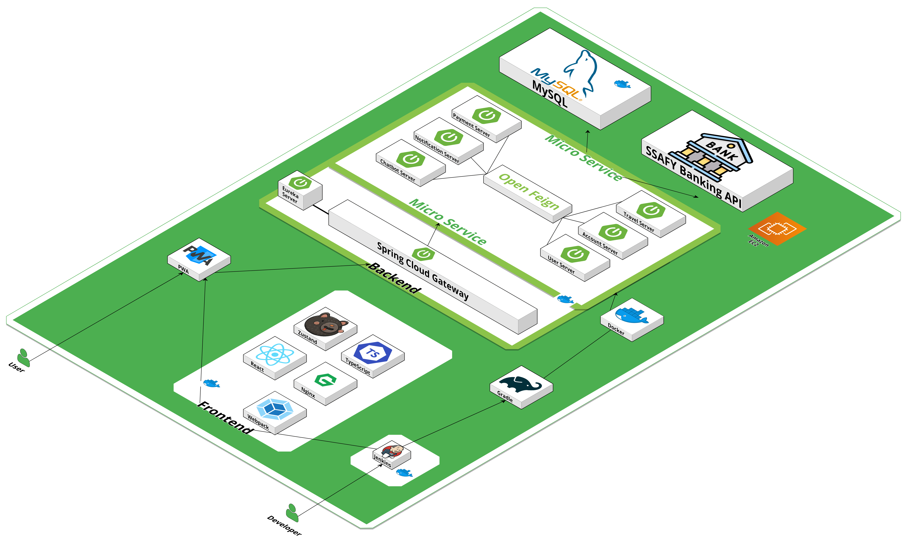

<br>

### 2. 기술스택

[](https://skillicons.dev)
<br>
[](https://skillicons.dev)

<br>
<br>

## 📱시연 움짤

### 1. 통장

|                                                          |                                                      |                                                      |
| -------------------------------------------------------- | ---------------------------------------------------- | ---------------------------------------------------- |
| 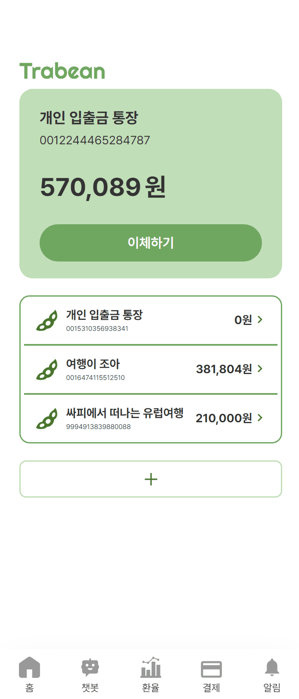 | 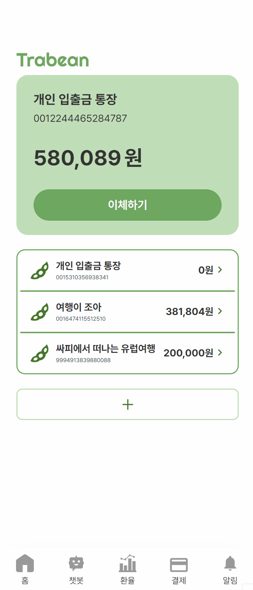 | 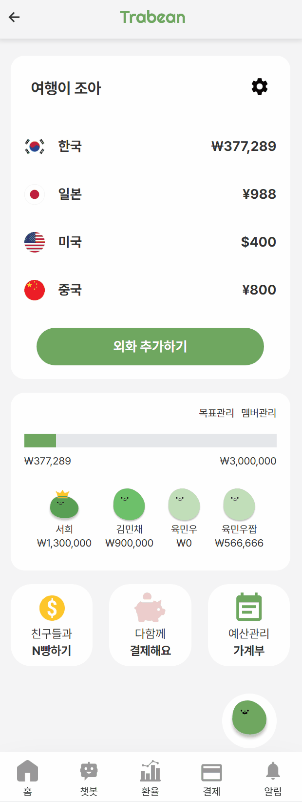 |
| ✨ 통장 개설                                             | 📌 계좌이체                                          | ✔ 통장 필터                                          |

<br>

### 2. 여행통장

|                                                          |                                                          |
| -------------------------------------------------------- | -------------------------------------------------------- |
|  | 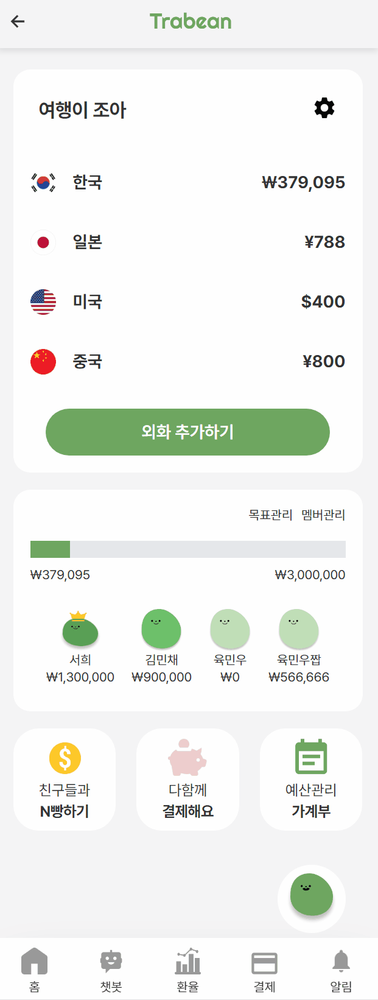     |
| ✨ 외화통장 개설                                         | 💰 외화충전                                              |
| 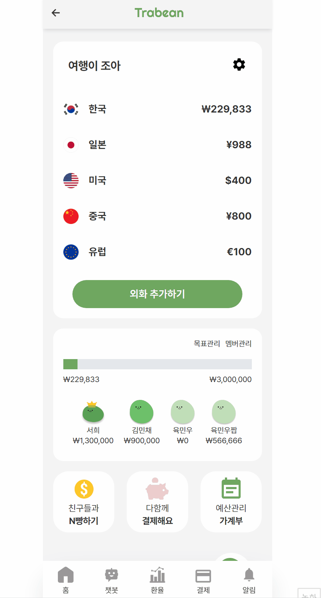     | 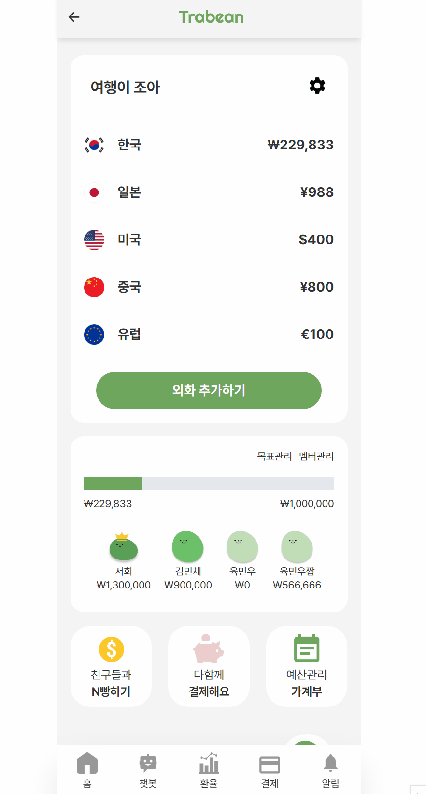          |
| 🎯 목표 설정                                             | 👨‍👧‍👦 N빵                                                   |
| 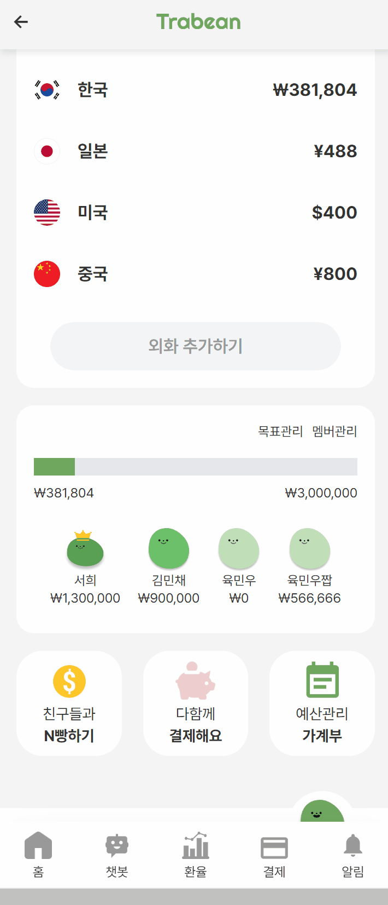       | 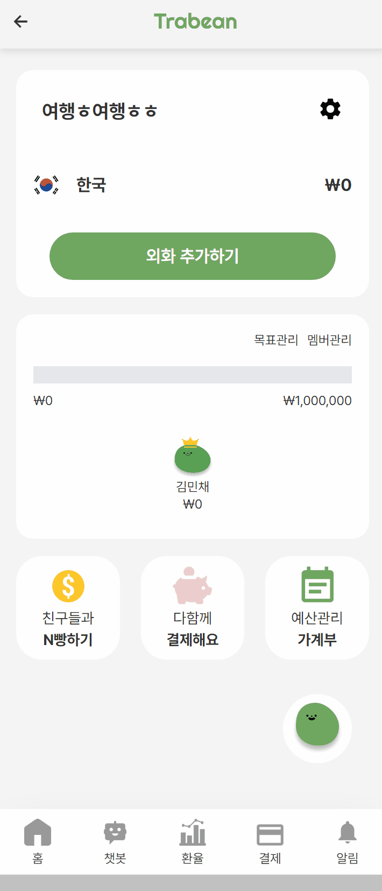 |
| 📜 가계부                                                | 📢 여행통장 초대                                         |

|                                                      |
| ---------------------------------------------------- |
| 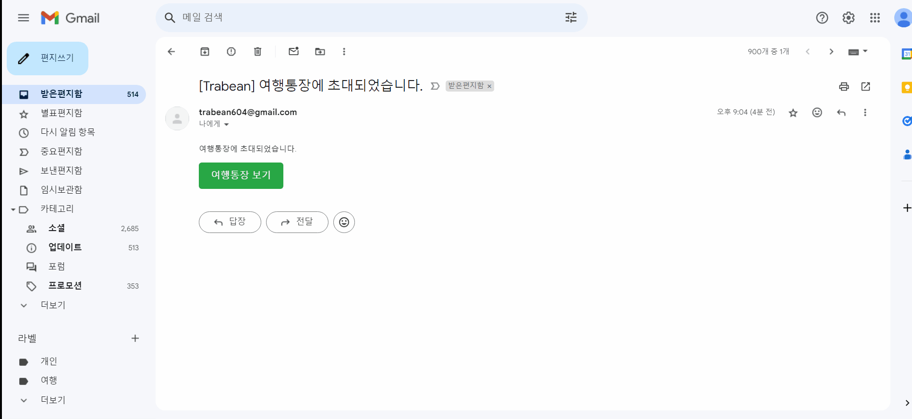 |
| 🎇 멤버 가입                                         |

<br>

### 3. 결제

|                                                       |                                                         |
| ----------------------------------------------------- | ------------------------------------------------------- |
| 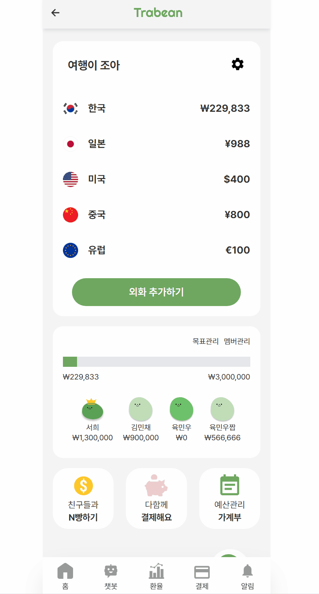      |  |
| 👐 권한관리                                           | 💳 결제기능                                             |
| 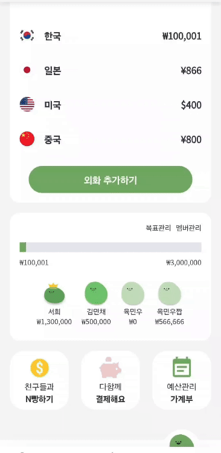 | 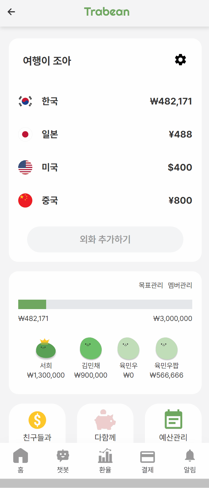   |
| 💵 결제 외화                                          | 💸 자동환전                                             |

<br>

### 4. 챗봇

|                                                       |                                                       |                                                       |
| ----------------------------------------------------- | ----------------------------------------------------- | ----------------------------------------------------- |
|  |  |  |
| 💰 저축                                               | 🗨 채팅                                                | 💴 환전                                               |

|                                                                    |                                                                    |
| ------------------------------------------------------------------ | ------------------------------------------------------------------ |
|  |  |
| 📃 여행장소 설문                                                   | 🗺 여행장소 지도                                                    |

<br>
<br>

## 🔧 ERD

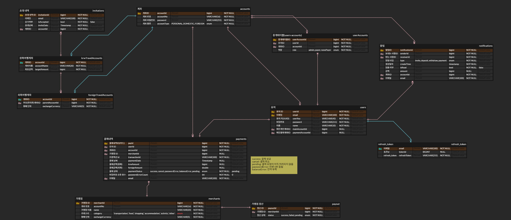

<br>
<br>

## 📁 프론트 폴더구조

```
📦src
 ┣ 📂assets
 ┣ 📂components
 ┣ 📂pages
 ┃ ┣ 📂AccountCreationPage
 ┃ ┣ 📂Exchange
 ┃ ┣ 📂ForeignTransferPage
 ┃ ┣ 📂InvitePage
 ┃ ┣ 📂JoinPage
 ┃ ┣ 📂LoginPage
 ┃ ┣ 📂MainPage
 ┃ ┣ 📂NotificationPage
 ┃ ┣ 📂PaymentPage
 ┃ ┣ 📂SplitPage
 ┃ ┣ 📂TransferPage
 ┃ ┣ 📂TravelAccount
 ┣ 📂routes
 ┣ 📂store
 ┣ 📂utils

```

## 🔎 백엔드 구조

<br>
<br>

## 😶 팀원소개

|                                                    |                                                            |                                                                                  |          |                                                                        |                                                    |
| :---------------------------------------------------------------------------------------------------------: | :-----------------------------------------------------------------------------------------------------------------: | :---------------------------------------------------------------------------------------------------------------------------------------: | :---------------------------------------------------------------: | :-----------------------------------------------------------------------------------------------------------------------------: | :---------------------------------------------------------------------------------------------------------: |
|                                                   김민채                                                    |                                                       김인실                                                        |                                                                  남윤희                                                                   |                              박세건                               |                                                              서희                                                               |                                                   육민우                                                    |
|                                              Backend, Frontend                                              |                                                  Backend, Frontend                                                  |                                                             Backend, Frontend                                                             |                          Backend, Infra                           |                                                        Backend, Frontend                                                        |                                              Backend, Frontend                                              |
| 기획, DB설계, <br> 화면 디자인 <br> 결제 로직 구현 (payment) <br> 화면 구현 및 API 연동 <br> (결제, 가계부) | 기획, DB설계, <br> 캐릭터 및 화면 디자인 <br> 챗봇 구현 (chatbot) <br> 화면 구현 및 API 연동 <br> (통장 개설, 챗봇) | 기획, DB설계, <br> 화면 디자인 <br> Security 로그인, <br> 회원 관련 API 구현 (user) <br> 화면 구현 및 API 연동 <br> (계좌이체, N빵, 환율) | 기획, DB설계 <br> Infra, CI/CD <br> 알림 기능 구현 (notification) | 기획, DB설계, <br> 화면 디자인 <br> 여행통장 및 환율 API 구현 (travel) <br> 화면 구현 및 API 연동 <br> (회원, 메인페이지, 알림) | 기획, DB설계, <br> 화면 디자인 <br> 통장 공통 기능 API 구현 (account) <br> 화면 구현 및 API 연동 (여행통장) |
